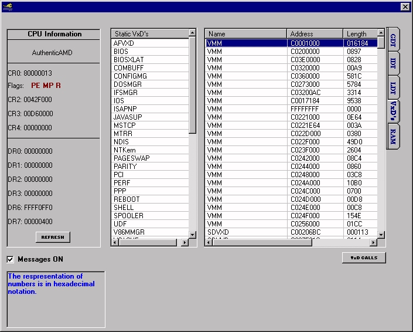



## Protected Mode

### Description

Perform at ring0 level. Shows how to operate at ring0 from visual basic several ways, int 20, calls and deviceiocontrol. Hopefully this program and the included documentation will help you in some way. GDT, LDT, IDT, status control registers and flags, VxD's, service calls all explained and with good documentation. Many examples in the program. Check it out.
 
### More Info
 
Especially read these included files:

GDT_info.txt a great article by Yann Stephen to

give an explantion on how the protected mode works.

vmm.inc - useful information.

assmTut_vxd.txt - The basic file used to create the blue screen of death Message.

The vxd is accessed via deviceiocontrol. There is 1 service call and that is the blue screen that appears. from a call to SHELL_SYSMODAL_MESSAGE

services.dat - lists the major ring0 service calls

             |
---                |---
**Submitted On**   |2005-03-09 19:07:14
**By**             |[Mark Duhame](https://github.com/Planet-Source-Code/PSCIndex/blob/master/ByAuthor/mark-duhame.md)
**Level**          |Advanced
**User Rating**    |4.7 (14 globes from 3 users)
**Compatibility**  |VB 6\.0
**Category**       |[Complete Applications](https://github.com/Planet-Source-Code/PSCIndex/blob/master/ByCategory/complete-applications__1-27.md)
**World**          |[Visual Basic](https://github.com/Planet-Source-Code/PSCIndex/blob/master/ByWorld/visual-basic.md)
**Archive File**   |[Protected\_186309392005\.zip](https://github.com/Planet-Source-Code/mark-duhame-protected-mode__1-59402/archive/master.zip)

